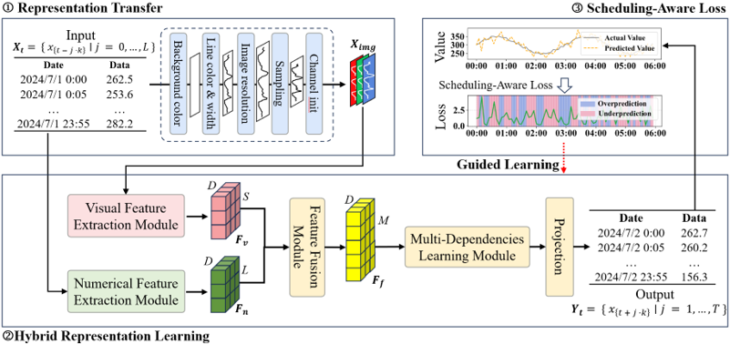

# HRS: Hybrid Representation Framework with Scheduling Awareness for Time Series Forecasting

[](https://www.python.org/downloads/)
[](https://pytorch.org/)

This is the official PyTorch implementation of the ECAI 2025 paper "HRS: Hybrid Representation Framework with Scheduling Awareness for Time Series Forecasting in Crowdsourced Cloud-Edge Platforms".

## 📖 Paper Introduction

HRS is an innovative hybrid representation learning framework specifically designed for time series forecasting tasks in crowdsourced cloud-edge platforms. The framework combines the advantages of numerical and image representations while introducing a scheduling-aware loss function to optimize prediction performance.

## 🏗️ Framework Architecture



The HRS framework consists of three core components:

1. **Image Representation Conversion**: Transforms numerical time series into image representations
2. **Hybrid Feature Learning**: Extracts features from both numerical and image inputs and fuses them
3. **Scheduling-Aware Loss**: Guides learning through asymmetric penalties

## 🚀 Quick Start

### Environment Requirements

- Python 3.9
- PyTorch 2.6.0


### Install Dependencies

```bash
# Install dependencies
pip install -r requirements.txt
```

### Data Preparation

The project includes the datasets located in the `data/` directory.

## 🎯 Usage

### Training Models

The project provides training scripts for different datasets and sequence lengths, located in the `scripts/` directory. You can also use `run.py` directly for custom training:

## 📚 Citation

If you use HRS in your research, please cite our paper:

```bibtex
@inproceedings{hrs2025,
  title={HRS: Hybrid Representation Framework with Scheduling Awareness for Time Series Forecasting in Crowdsourced Cloud-Edge Platforms},
  author={Tiancheng Zhang, Cheng Zhang, Shuren Liu, Xiaofei Wang, Shaoyuan Huang, Wenyu Wang},
  booktitle={Proceedings of the European Conference on Artificial Intelligence},
  year={2025}
}
```

## 🙏 Acknowledgements

We would like to express our sincere gratitude to the following open-source repositories, which inspired and supported the development of this project:

- [DynEformer](https://github.com/hsy23/KDD23_DynEformer)
- [Informer2020](https://github.com/zhouhaoyi/Informer2020)
- [TimesNet](https://github.com/thuml/Time-Series-Library)


## 📞 Contact

If you have any questions, please contact us through:

- Send email to: [tianchengzhang@tju.edu.cn]

---

⭐ If this project is helpful to you, please give us a star!


